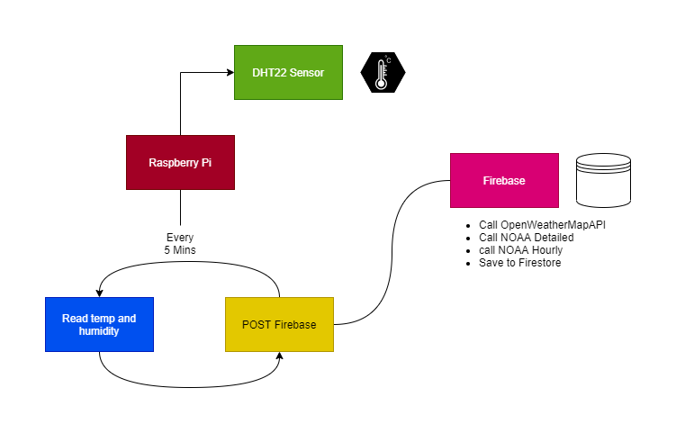

# Evans Weather2

This is the open source version of my home weather station. I outline the project in my post [Building a Weather Station with JavaScript](https://rhythmandbinary.com/post/2021-09-27-building-a-weather-station-with-javascript).

The project uses the following hardware:

- [Raspberry Pi Zero W](https://www.raspberrypi.org/products/raspberry-pi-zero-w/)
- [DHT 22 Sensor (you can get these on Amazon)](https://www.amazon.com/HiLetgo-Temperature-Humidity-Electronic-Practice/dp/B0795F19W6/ref=sr_1_4?dchild=1&keywords=DHT22+Sensor&qid=1632775043&sr=8-4)
- [Jumper wires](https://www.amazon.com/dp/B01EV70C78?ref=nb_sb_ss_w_as-ypp-rep_ypp_rep_k0_1_12&crid=34UWSDSNQJS5K&sprefix=jumper+wires)
- [A Firebase Account](https://firebase.google.com/)
- [VSCode](https://code.visualstudio.com/)

The project is comprised of the following:

- Weather Sensor
  - Raspberry Pi hooked up to a DHT22 sensor in the folder [weather-sensor](./weather-sensor)
  - Firebase Functions Serverless API in the folder [weather-server](./weather-server)
  - Electron App (originally React) in the folder [weather-page](./weather-page)

The high level Architecture of this project is that the sensor collects temperature and humidity, and then does a POST to Firebase. When the POST happens, it then triggers calls to [NOAA APIs](https://www.weather.gov/) for projected forecast and hourly temperatures, and then the [OpenWeatherMapAPI](https://openweathermap.org/api) to get the barometric pressure and wind information. The Electron App polls the Firebase API to get the weather information every 5 minutes.

I found that most of this project can be googled. I recommend reading my article and looking at some of the links I share for more info.
